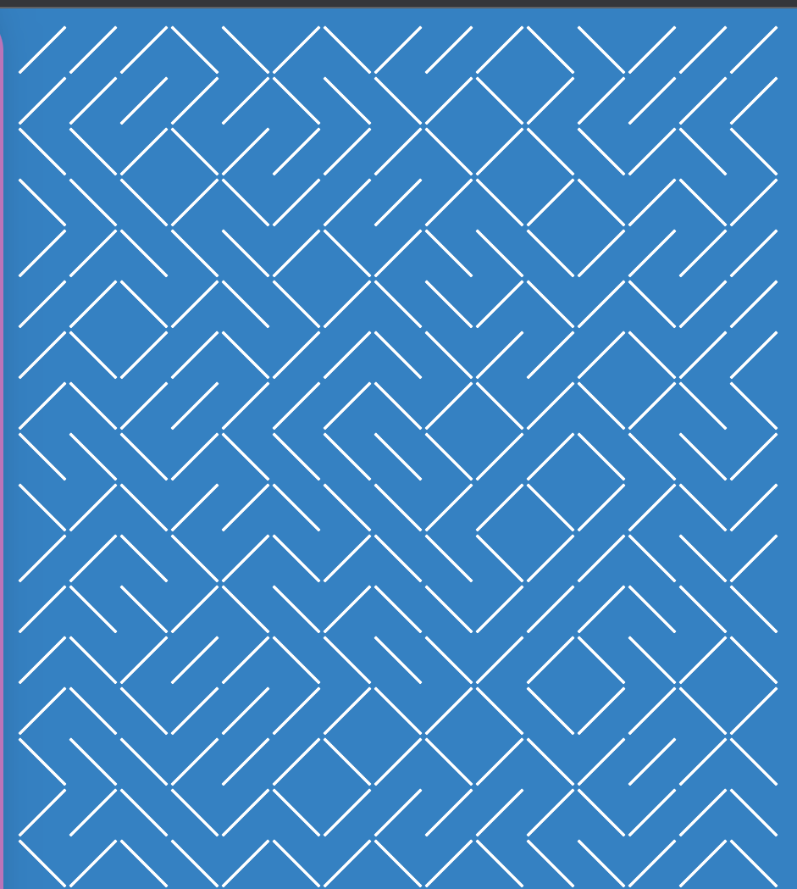

# Pattern-generator-test

[link to project](https://beckaseifert.github.io/Pattern-generator-test/)

This project was a recreation of the 10Print pattern originally created in Basic. Created using Javascript.
